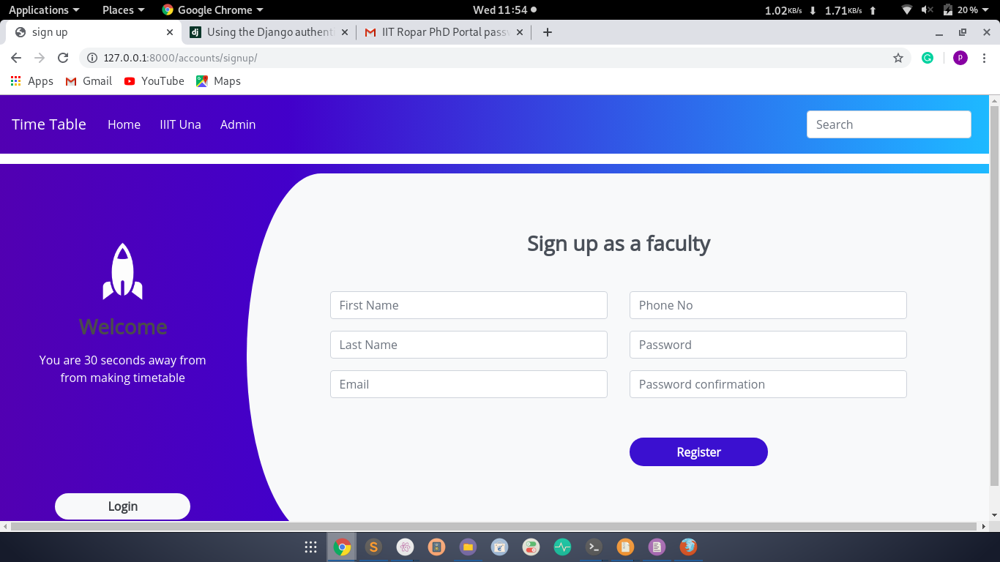
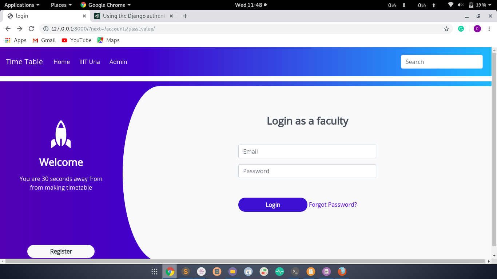
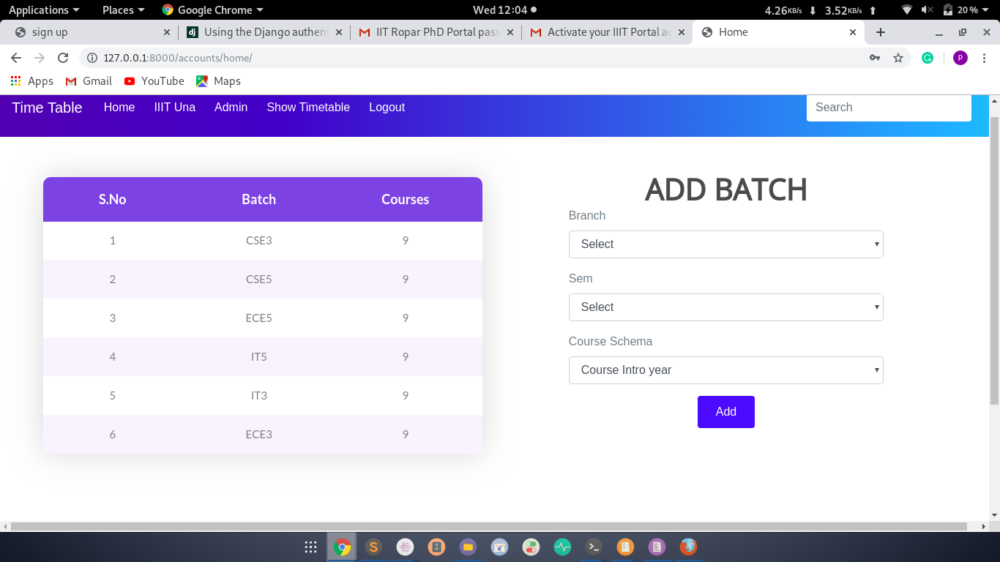
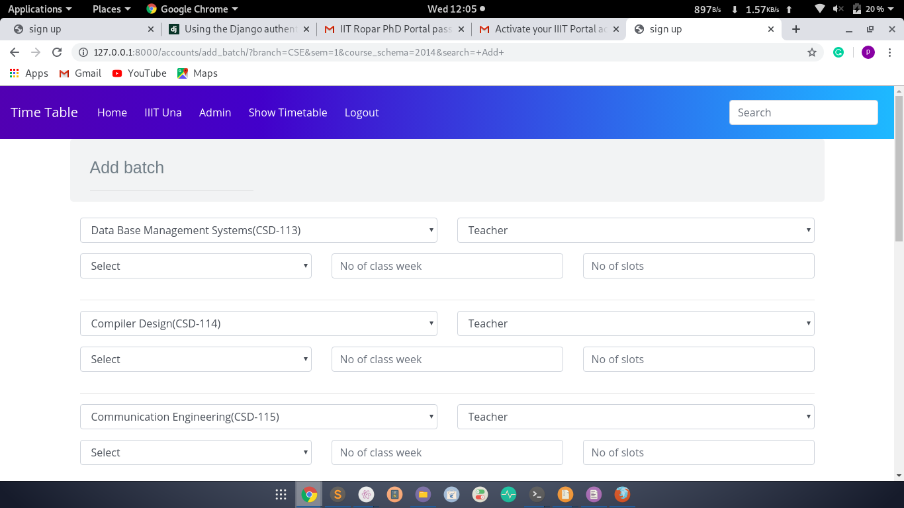
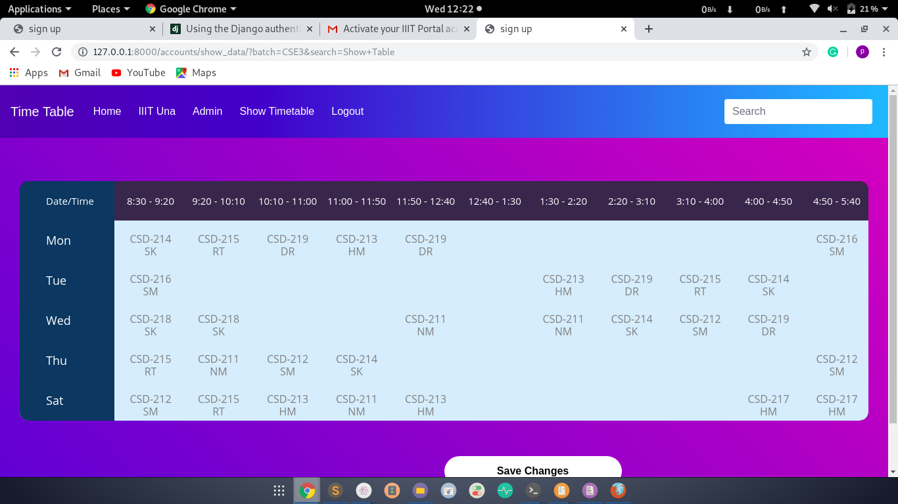

# Timetable Generator
Timetable Generator is a Django Mysql web app used to generate timetable automatically.It will help to manage all the periods automatically after maximum and minimum work load for a Faculty for a day, week and month will be specified for the efficient generation oftimetable.It is a comprehensive timetable management solutions for Colleges which help to overcome the challenges in manually setting the timetable.Since every college has its own timetabling problem, the commercially available software packages may not suit the need of every college. So I developed an app for my college.

### Snaps

### Prerequisites
- Virtual Environment
- Mysql
- Python 3.7

### Installation
`pip install django==2.2.17`

`pip install bcrypt`

`pip install django[argon2]`

`pip install pillow`

`pip install django-bootstrap4`

`pip install python-dateutil`

`pip install django-braces`

`git clone https://github.com/sirkp/timetable.git`

`python manage.py makemigrations` 
  
`python manage.py migrate`
  
`python manage.py createsuperuser`
  
`python manage.py runserver` 

### Reference
[Django Reference](https://docs.djangoproject.com/en/2.2/ref/)
 
